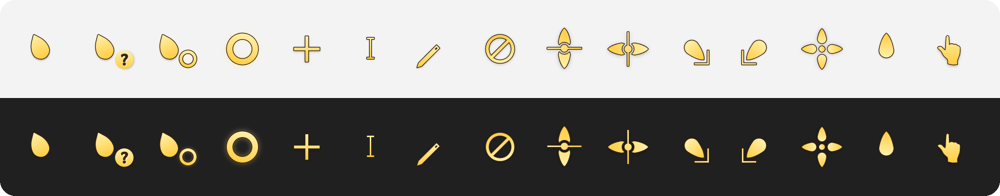

<div align="center">

# Layan Cursors (Gold) for Windows

**A warm gold edition of the Layan cursors for Windows 11, rendered from the original vector artwork at every size
Windows picks for your display scale and pointer size.**

[](https://github.com/hervad/Layan-Gold-cursors-for-Windows/releases/latest)
[](#install)
[](LICENSE)



</div>

## Install

1. **Download** `layan-gold-w11-hidpi-v….zip` from the [latest release](https://github.com/hervad/Layan-Gold-cursors-for-Windows/releases/latest)
   and extract it.
2. **Right-click** `install.inf` in the extracted `Layan Cursors (Gold)` folder and choose **Install**, then approve the
   administrator prompt. On Windows 11, **Install** is under **Show more options**.
3. **Apply:** Mouse Properties may open by itself; if it doesn't, press <kbd>Win</kbd>+<kbd>R</kbd> and run `main.cpl`.
   On the **Pointers** tab, pick **Layan Cursors (Gold)** and click **OK**.

**Upgrading from v2?** Just install: the scheme keeps its name and folder, so it updates in place. v2's own files
(`arrow.cur`, `pen.cur`, `size_ns.cur` …) stay in the folder unused; for a clean folder, run v2's `uninstall.cmd` first
or delete `C:\Windows\Cursors\Layan Cursors (Gold)` before installing.

## Why they stay sharp

Windows doesn't scale cursors smoothly. It takes the pointer size from **Settings › Accessibility › Mouse pointer
and touch** (size 1 = 32 px, each step adds 16 px), multiplies it by a factor that depends on your display scale,
and then looks for an image of exactly that size inside the cursor file. If the file doesn't have it, Windows
resamples the nearest one, and resampling blurs.

Every cursor here contains each of those sizes, rendered from the original vector artwork, never resampled:

| Display scale | Pointer size 1 | Size 2 | Size 3 | Size 4 | Size 5 | |
| --- | :-: | :-: | :-: | :-: | :-: | --- |
| 100–149 % | 32 px | 48 px | 64 px | 80 px | 96 px | measured |
| 150–199 % | 48 px | 72 px | 96 px | 120 px | 144 px | measured |
| 200–249 % | 64 px | 96 px | 128 px | 160 px | 192 px | assumed |
| 250–299 % | 80 px | 120 px | 160 px | 200 px | 240 px | assumed |
| 300 %+ | 96 px | 144 px | 192 px | 240 px | 256 px | assumed |

The two **measured** rows come from a size probe on Windows 11 25H2 (build 26200), where the factor is 1.0 from
100 % to 149 % and 1.5 from 150 % to 199 %. The **assumed** rows continue that pattern; they couldn't be measured
on the test screen, so the files simply include those sizes as well. Larger pointer sizes follow the same rule,
up to Windows' 256 px maximum.

- **Static cursors** are exact for every pointer size in every row.
- **Busy and working** (animated) are exact for pointer sizes 1–5 at 100–149 % and 1–4 at 150–199 %. Elsewhere Windows
  resizes the closest image. The busy ring's glow is heavy, and Windows refuses an animation frame whose images start
  past its first 64 KB, so the animations stop at 128 px.
- **At 125 % and 175 %** some softness is normal and can't be fixed by any cursor theme: Windows uses the 100 % or
  150 % image there and stretches it to fit.

**No performance cost.** Windows decodes a cursor once, when you switch scheme or pointer size, and animation only
flips between images it has already decoded. Measured on Windows 11 25H2 against Microsoft's own `aero` cursors
(same machine, same run):

| | Layan Gold | Windows aero |
| --- | --- | --- |
| Load a static cursor (32–96 px) | 0.2–0.3 ms | 0.1–0.2 ms |
| Load an animated cursor (32–96 px) | 2–5 ms | 1–4 ms |
| Load an animated cursor (256 px) | 32 ms | 20 ms |
| GDI / USER handles left behind after 300 loads | 0 / 0 | 0 / 0 |

Before every release, GitHub Actions loads every file with the real Windows cursor loader at several sizes; a
failure blocks the release.

## What's included

- **All 17 Windows pointer roles:** normal, help, working in background, busy, precision, text, handwriting,
  unavailable, 4 resize directions, move, alternate, link, location and person select. Location and person select use
  the pointing hand (Layan has no artwork for them; before v3 they were left empty).
- **Animated busy and working cursors:** 23 frames each, as in the original.
- **Hotspots** on the visible tip of each pointer, at every size.
- `install.inf` and `uninstall.cmd`, plus the licence and credits.

| Palette | Colour |
| --- | --- |
| Highlight | `#FFF0AB` |
| Body | `#FFCD42` |
| Outline | `#392310` |

## Uninstall

1. Run `uninstall.cmd` from the extracted folder. It removes the scheme from the list and opens Mouse Properties.
2. Pick another scheme and click **OK**.
3. Delete the cursor files from an administrator PowerShell:

```powershell
Remove-Item "C:\Windows\Cursors\Layan Cursors (Gold)" -Recurse
```

## Troubleshooting

- **No "Install" option:** on Windows 11, choose **Show more options** or press <kbd>Shift</kbd>+<kbd>F10</kbd>. Extract
  the zip first; Windows can't install from inside it.
- **Cursors went back to Windows' own:** choosing a **Mouse pointer style** in Accessibility settings replaces the
  scheme. Select **Layan Cursors (Gold)** again in `main.cpl › Pointers`.
- **Some apps show other cursors:** browsers (for CSS cursors), games, and some creative tools draw their own cursors.

## Build from source

Since v3 the cursors are built with [w11-cursor-toolkit](https://github.com/hervad/w11-cursor-toolkit). The unmodified
upstream SVGs are in [`src/svg`](src/svg); [`tools/goldify.py`](tools/goldify.py) applies the gold palette, outline and
help-glyph styling, and [`theme.toml`](theme.toml) describes the rest (roles, hotspots, sizes). Rendering uses resvg,
which the toolkit installs.

```powershell
python -m pip install "w11cursor @ git+https://github.com/hervad/w11-cursor-toolkit@v0.4.0"
python tools/goldify.py                       # src/svg -> build/gold
w11cursor build    theme.toml --out dist
w11cursor validate theme.toml --dist dist
```

Releases are built by GitHub Actions from a version tag. [TECHNICAL.md](TECHNICAL.md) explains the styling, hotspots
and sizes.

## Credits

The artwork is from [Layan cursors](https://github.com/vinceliuice/Layan-cursors) by vinceliuice, which is based on
[Capitaine Cursors](https://github.com/keeferrourke/capitaine-cursors) by Keefer Rourke. See [CREDITS.md](CREDITS.md).
Licensed under the [GNU GPL v3.0](LICENSE).
